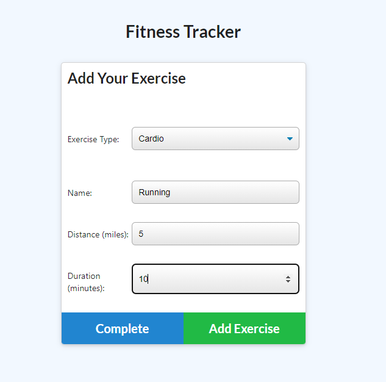

# workoutTracker

## Description

- To give potential user insight on how to track their workouts.
- This project was developed to help the user understand the process of working out.
- Having a workout tracker will keep user more engaged with exercise. 

## Table of Contents 

- [Installation](#installation)

- [Usage](#usage)

- [License](#license)

## Installation
>The first thing you need to do is to go into Github and create a repo. 

>Then install npm inquirer

>Then your dependencies will be added package.json, & package-lock.json

## Usage

  

## License

 [Apache](http://www.apache.org/licenses/)
---